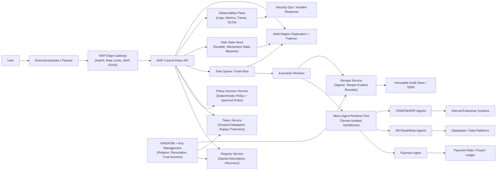

# MAP Target Production Architecture (Best-Practice Blueprint)

## Purpose

This document defines the target architecture MAP should be built toward for high-security, high-scale production deployments.

This is the "build-to" architecture for the project.

## Design Principles

1. Zero-trust by default across every boundary.
2. Company-owned execution for sensitive operations.
3. Deterministic policy before execution.
4. Scoped, short-lived, replay-resistant delegation authority.
5. Output minimization and redaction by default.
6. Durable, auditable state transitions for every task.
7. Tenant isolation as a first-class invariant.
8. SLO-driven operations with explicit incident workflows.

## Target System Diagram

## Component Responsibilities

### 1. MAP Edge Gateway

1. Enforce transport authentication and authorization gates.
2. Apply global rate limiting and abuse prevention.
3. Provide request shaping and admission control.
4. Attach request correlation metadata.

### 2. Control Plane API

1. Validate envelope shape and protocol versioning.
2. Resolve exact target agent and capability (no silent fallback).
3. Coordinate policy decisions, token issuance, and lifecycle writes.
4. Return deterministic status transitions and structured errors.

### 3. Policy Decision Service

1. Evaluate deterministic policy before any state-changing execution.
2. Produce auditable decision artifacts.
3. Enforce approval-required transitions for high-risk operations.

### 4. Token Service

1. Issue scoped delegation tokens with strict expiry.
2. Bind token audience, action, resource scope, requester, and nonce.
3. Support replay detection and revocation-aware validation.

### 5. Task Queue + Workers

1. Support reliable async dispatch and retries with jitter.
2. Isolate poison messages through dead-letter queues.
3. Preserve idempotency guarantees across retries.

### 6. Runtime Pool

1. Execute micro-agents in tenant-isolated sandboxes.
2. Enforce token action/resource constraints at runtime.
3. Enforce output minimization and redaction controls.

### 7. Receipt + Audit Plane

1. Produce tamper-evident receipts for commit operations.
2. Persist immutable audit records.
3. Support offline verification and forensic replay.

### 8. Observability + Security Ops

1. Correlate logs, metrics, traces by `request_id` and `task_id`.
2. Track SLOs and error budgets.
3. Trigger runbooks for authz bypass, key compromise, replay spikes, and denial anomalies.

## Non-Negotiable Invariants

1. `target_agent` must be explicit and strictly bound.
2. `/approve` must require a persisted pending approval state.
3. Runtime must reject out-of-scope tokens even when signatures are valid.
4. All state-changing operations must emit verifiable receipts.
5. Cross-tenant actions are deny-by-default.

## Build Sequence (Execution Order)

### Stage 0: Protocol and Trust Correctness

1. Enforce strict agent-capability binding.
2. Enforce approval state chain.
3. Enforce token action/resource scope and replay protections.

### Stage 1: Durability and Idempotency

1. Replace in-memory stores with durable task and receipt stores.
2. Add idempotency identity and deterministic dedup behavior.
3. Introduce queue-backed async execution.

### Stage 2: Multi-Tenancy and Scale

1. Add tenant context to core objects and storage partitioning.
2. Add worker pool isolation and scaling controls.
3. Introduce multi-region replication/failover strategy.

### Stage 3: Enterprise Operations

1. Add asymmetric key profile and revocation workflows.
2. Finalize SLOs, incident runbooks, and compliance profiles.
3. Ship conformance and certification harness for ecosystem adoption.
